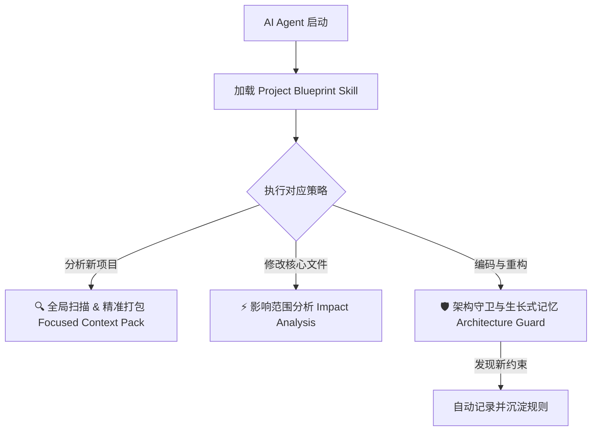

# 🤖 Project Blueprint Agent Skill 🚀

[](https://opensource.org/licenses/MIT)
[](https://www.python.org/)
[](#-agent-skill-集成)

**Project Blueprint** 是一款专门为 **AI 编程助手（如 Claude Code、Cursor、Aider、OpenClaw 等）** 设计的**智能项目架构分析、影响分析与动态架构守卫工具**。

它既是一个强大的本地命令行工具，又是一个赋能 AI Agent 的 **Custom Skill (自定义技能)**。旨在解决 AI Agent 在接手新项目时“上下文容易爆炸”、“乱改核心文件”、“不懂项目架构规范”的痛点！

---

## 🌟 核心痛点与解决方案

在将项目交给 Claude Code 或 Cursor 等桌面 Agent 编写时，常见三个痛点：
1. **上下文爆炸**：项目文件太多，Agent 一股脑全读进去，消耗大量 Token 且容易使 Agent 变糊涂。
2. **乱改代码**：Agent 随便修改核心逻辑，导致其他依赖该模块的地方全部报错。
3. **架构失守**：团队有一些潜规则或架构约束（如“不要使用 lodash”、“Controller 别混入 Model 逻辑”），Agent 不知情或者转头就忘。

**Project Blueprint 提供了完美的解决方案：**



---

## ✨ 核心特性

### 1. 🔍 智能项目扫描与精准打包 (Focused Context Pack)
* **全局项目蓝图**：一键扫描项目目录，智能跳过 `node_modules`、`__pycache__` 等无关目录，自动生成包含技术栈、目录树、文件职责说明的 `PROJECT_BLUEPRINT.md`。
* **微型上下文包 (Micro-index)**：针对具体任务，可让 Agent 只提取某个特定模块及其上下游依赖的轻量级 JSON，避免无关代码淹没 Agent。

### 2. ⚡ 影响范围分析 (Impact Analysis)
* 当你想改某个底层核心文件时，只需让 Agent 运行 `python -m project_blueprint -i <file_path>`，工具会自动识别并列出所有导入/引用了该文件的模块，防止牵一发而动全身。

### 3. 🛡️ 架构守卫与“生长式记忆” (Architecture Guard)
* **约定自动加载**：将当前项目的禁止事项、命名规范、依赖方向写入 `.blueprint_rules.json`。Agent 每次读取蓝图时均能强制遵循。
* **生长式记忆**：在编码过程中，一旦你和 Agent 达成共识（例如“以后我们都不能使用 `requests`，用 `httpx` 代替”），Agent 会自动执行 `--add-rule` 命令行指令，**将新规则持久化写入规则库**。再次启动 Agent 后，记忆仍然保留！

---

## 📂 项目结构

```
.
├── project_blueprint/      # 核心分析模块
│   ├── analyzer.py         # 智能项目分析器
│   ├── ast_parser.py       # AST 静态依赖与引用解析
│   ├── rules.py            # 架构规则守卫逻辑
│   ├── scanner.py          # 目录树扫描器
│   └── ...
├── SKILL.md                # 赋予 AI Agent 的 Skill 提示词与指令集
├── skill.json              # 适用于部分 Agent 平台的结构化 Skill 定义
├── run_blueprint.py        # 顶层快速启动入口
├── .blueprint_rules.json   # 动态生长的架构规范数据库 (Memory)
└── USAGE.md                # 详细的使用指南
```

---

## 🚀 快速开始

### 1. 克隆与安装

```bash
# 克隆仓库
git clone https://github.com/zzhqqa478850-lang/project-blueprint-agent.git
cd project-blueprint-agent

# 安装为可编辑模式
pip install -e .
```

### 2. 命令行体验

```bash
# 1. 扫描当前目录，生成 PROJECT_BLUEPRINT.md
python run_blueprint.py

# 2. 精准查询特定模块及上下游依赖
python -m project_blueprint -q "utils" -j

# 3. 分析修改某个文件可能带来的外部影响 (Impact Analysis)
python -m project_blueprint -i "project_blueprint/scanner.py" -j

# 4. 新增一条架构约束守卫 (将会自动记录在 .blueprint_rules.json 中)
python -m project_blueprint --add-rule "所有工具类方法必须有类型注解"
```

---

## 🤖 Agent Skill 集成

要在您的 AI Agent (如 Claude Code, Aider, Cursor 等) 中开启此技能，只需将 `SKILL.md` 的内容加载到 Agent 的运行上下文中。以下是主流 Agent 的集成方法：

### 1. 💻 Claude Code (推荐)
Claude Code 会在启动时自动读取工作区内的文档。
* **极简集成**：直接将本项目中的 `SKILL.md` 文件放在您正在开发的项目根目录下。
* **效果**：当您向 Claude 发出开发指令时，它会主动执行 `python -m project_blueprint` 来分析架构，并在同意新架构规则时运行 `--add-rule` 保存“生长式记忆”。

### 2. 🎛️ Cursor (Composer / Agent 模式)
Cursor 支持项目级规则文件 `.cursorrules`。
* **集成步骤**：
  1. 在您的项目根目录下创建一个名为 `.cursorrules` 的文件。
  2. 将本仓库根目录下 `SKILL.md` 中的**所有 Prompt 文字（从 `# Project Blueprint` 开始）**复制粘贴进去。
* **效果**：Cursor 在 Agent 或 Composer 模式下写代码前，会自动阅读此规则，并学会使用命令行工具分析依赖和保存规则。

### 3. ⌨️ Aider
Aider 支持通过自定义指令文件来引导 Agent 的行为。
* **集成方法**：
  * 启动 Aider 时指定指令文件：
    ```bash
    aider --instructions SKILL.md
    ```
  * 或者直接将 `SKILL.md` 的内容追加到您项目根目录的 `.aider.instruction.md` 中。

### 💡 Agent 的工作流演练
1. **接手新项目** ➡️ Agent 自动运行 `python -m project_blueprint -j` 生成项目地图，快速了解全局，并展示 `## 🛡️ 架构规范与守卫` 中已有的约束。
2. **准备修改核心逻辑** ➡️ Agent 自动运行 `python -m project_blueprint -i <file_path>` 确认修改可能引发的问题，主动向用户汇报风险。
3. **沉淀新规矩** ➡️ 用户说：“在这个项目里我们不要用 PyPDF2 了，统一换成 pdfplumber。”Agent 立即通过终端运行 `python -m project_blueprint --add-rule "禁止使用 PyPDF2，统一用 pdfplumber"`。规则在 `.blueprint_rules.json` 中永久生效！

---

## 🤝 参与贡献

欢迎对静态分析、AST 依赖识别、更多语言的支持提交 Issue 和 Pull Request！
一起把 `project-blueprint` 打造为最懂 AI Agent 的项目辅助利器！

## 📄 许可证

本项目基于 [MIT License](LICENSE) 开源。
