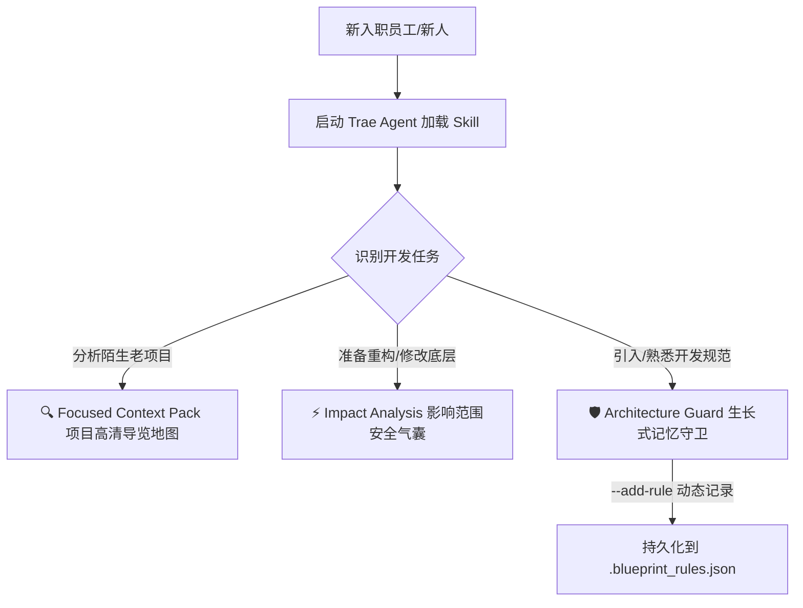

# 🏆 【Trae Skill 创作】刚入职接手几万行代码一脸懵？我做了一个帮“职场新人”快速看懂项目、避开“代码雷区”的【项目蓝图与架构守卫】 Skill!

大家好！我是开发者 **zzhqqa478850-lang**。

今天想在 Trae 社区分享一个我最近花费大量心血打磨的项目级辅助 Skill：**Project Blueprint (项目蓝图与架构守卫)**。

* 🔗 **开源仓库地址**：[https://github.com/zzhqqa478850-lang/project-blueprint-agent](https://github.com/zzhqqa478850-lang/project-blueprint-agent)
* 💡 **核心定位**：项目静态依赖雷达 + 具备“自我生长式记忆”的架构守卫

---

## 📌 创作初衷：每一个“刚入行新人”都曾有过的窒息瞬间

这个 Skill 的创意，源自我和身边一些刚刚步入编程职场的朋友、同事的**亲身痛点**。

大家回想一下，自己刚进入一家新公司，或者刚接手一个完全陌生的项目时，最害怕的是什么？
* **面对几万行、甚至十几万行且毫无文档说明的代码森林**，不知道该从哪个入口看起，不知道每个文件夹到底各司何职，像无头苍蝇一样没有半点头绪。
* **“改代码像踩地雷”**：由于对全局依赖不熟悉，小心翼翼地修改了一个底层公共函数，保存运行的一瞬间，控制台瞬间爆出几十个关联报错。那一刻血压飙升，挫败感极强，甚至开始怀疑自己的能力。
* **“踩中看不见的团队规矩”**：每个团队都有自己的架构“潜规则”（比如：*“不要引用第三方 Lodash，一律用原生 JS 实现”*；或者 *“新版数据解析统一用 A 库，禁止再引入 B 库”*）。新人不知道这些，一不小心写错了，Code Review 时尴尬又痛苦。

哪怕我们有强大的 Trae Agent 结对编程，在面对庞大项目时，Agent 也会因为**上下文过载而“降智”**，或者因为**不熟悉我们特定的项目规范**而写出违规代码。

为了让每一个刚入行的编程新人接手老项目时**“理清脉络不迷茫、改动底层不踩坑、融入规范不尴尬”**，我设计并实现了这款 **Project Blueprint**。它由一个**本地高性能 Python 静态分析引擎** + 一个**高度特化的 Trae 系统指令集（SKILL.md）**共同驱动。

---

## ✨ 核心特性深度解析：为新人量身打造的三大“安全防护”



### 1. 🔍 智能项目扫描与精准打包 (Focused Context Pack)
这是新人的“景区导览高清地图”。
* **一键项目蓝图**：在根目录运行 `python run_blueprint.py`，工具会智能跳过 `node_modules`、`venv` 等无关路径，自动解析项目技术栈、核心依赖和入口文件，为每个文件夹自动生成包含职责说明的 `PROJECT_BLUEPRINT.md`，帮新人快速理清代码骨架！
* **微型上下文打包 (Micro-index)**：当开发具体功能时，Agent 会通过 `python -m project_blueprint -q <module_name>` 只提取特定模块及其上下游依赖的轻量级 JSON 拓扑，**避免几万行的无关代码淹没 Agent 的上下文**，把 Token 消耗降低 90% 以上，让 Agent 保持极高智商！

### 2. ⚡ 影响范围分析雷达 (Impact Analysis)
这是新人修改底层的“安全气囊”，防止牵一发而动全身。
* 新手在重构或修改某个底层核心工具类（如 `custom_pdf_parser.py`）前，Skill 指令会强制 Trae Agent 自动在后台执行 `python -m project_blueprint -i <file_path>`。
* 静态分析引擎通过 AST 静态解析，**瞬间揪出所有引用/导入了此文件的上游模块**。
* Agent 会在修改前主动向新人汇报：“已为您启动影响范围雷达。修改该文件会影响上游的 3 个模块，我已为您制定了兼容性修改策略，修改完后将为您做联动验证。”让新手改代码底气十足！

### 3. 🛡️ 架构守卫与“自我生长式记忆” (Architecture Guard)
把团队潜规则变成 Agent 的“钢规铁律”和“自动生长的小本子”：
* **约定自动阅读**：项目的禁止事项、框架模式约定保存在根目录的 `.blueprint_rules.json` 中，Agent 每次拉取蓝图时强制阅读，防止新人越界。
* **生长式记忆**：在聊天开发中，你跟 Trae 说：*“我们项目以后所有的 API 响应都必须统一格式，且禁止直接返回 raw dict”*。Trae 在理解后，**会主动在终端执行命令行：**
  ```bash
  python -m project_blueprint --add-rule "API响应必须使用标准Response格式，禁止返回 raw dict"
  ```
  **直接将新规矩永久写入本地配置文件中**！即使你关闭了当前对话或清理了上下文，这条规则也会在下一次对话中被重新加载。这赋予了 Trae **跨越 Session 限制的生长式记忆**！

### 💡 4. 智能探测与主动依赖补全 (Proactive Dependency Detection)
很多新人的练习项目或者老旧项目里，经常没有写 `requirements.txt` 等配置文件，导致蓝图生成不完整。
* **主动出击**：如果扫描发现项目里缺少依赖文件，Skill 会驱动 Trae 主动分析所有代码的 `import` 关系，过滤掉标准库，整理出项目实际使用的第三方库列表。
* **温暖提议**：Trae 会主动问：“我发现您的项目是 Python 项目，但缺少 requirements.txt。我帮您识别出使用了 `chromadb` 和 `pdfplumber`，需要我现在帮您一键生成 `requirements.txt` 并补全项目蓝图吗？”极具人性化温度！

---

## 🛠️ 创作过程与技术演进：从“说明生成器”到“Agent-Native”的多次迭代

好的创意离不开严谨的技术方案论证。这个 Skill 并不是一蹴而就的，而是在与 AI 结对编程的过程中，经历了多次关键的技术设计自审、模块重构与演进才最终诞生出来的：

### 第一阶段：设计思路确立与“说明生成器”逻辑自审
我们首先对“项目蓝图”的核心——**说明生成器（Description Generator）**的逻辑进行了详尽的策略讨论。确立了它必须支持 Python、JS/TS、Java、Go、Rust 等多语言的智能推导，通过读取配置文件（`package.json`、`pyproject.toml` 等）、入口文件识别、命名匹配以及文件内容摘要（读取前几行获取注释和定义）来智能归纳子目录职责。

为了保证工程质量，我们严密制定了开发设计方案自审清单（Checklist），从核心模块、技术实现、交互方式、创新点到开发计划进行了逐一核对，并生成了项目设计文档 `2026-05-22-project-blueprint-design.md`。

> 💡 **（请在此处插入您的第 1 张截图：讨论第四部分说明生成器和核心逻辑的对话）**
> 
> 💡 **（请在此处插入您的第 2 张截图：包含设计自审完成和生成 project-blueprint-design.md 的对话）**

---

### 第二阶段：Agent-Native 2.0 深度架构重构
在初步实现了文件生成后，我们做了一个大胆的决定：**要让这个工具完全为 Agent 所用（Agent-Native）**。如果只生成 Markdown 文本，Agent 难以在后台调用并进行高精度的计算。因此，我们对整个静态分析引擎进行了一次革命性的 Agent-Native 2.0 重构：

1. **新增 `ast_parser.py`**：利用 Python 标准库中的 AST（抽象语法树）解析器，真正“阅读”和拆解 Python 代码，提取出 Class 定义、Function 定义以及 Import 关系。
2. **升级 `analyzer.py`**：基于 AST 数据自动构建项目内部的微缩索引（Micro-index）与反向依赖图（Reverse Import Graph），并且能自动推断出项目分层架构规则（如“Models 层独立于 Controllers 层”）。
3. **改造 `main.py` 和 `SKILL.md`**：在执行 `python run_blueprint.py -j` 时，直接在终端中吐出超高密度的结构化 JSON。Trae Agent 接收到这组结构化 JSON 后，能实现极其精准的全局依赖感知，彻底告别了“盲目猜测”和全库搜索！

重构的顺利完成，标志着 `Project Blueprint` 正式从一个“文档生成器”升华为了一个高情商、高密度的“Agent-Native 架构守卫”。

> 💡 **（请在此处插入您的第 3 张截图：关于 Agent-Native 2.0 重构完毕大功告成的对话）**

---

## 🚀 玩家如何把 Skill 装进您的 Trae？

得益于 Trae 极其强大的**终端工具自动执行能力**，仅需两步即可装配：

### 第一步：在您的本地环境中安装分析引擎
在您当前开发的项目根目录下：
```bash
git clone https://github.com/zzhqqa478850-lang/project-blueprint-agent.git
cd project-blueprint-agent
pip install -e .
```

### 第二步：让 Trae 感知 Skill
1. 在您的项目根目录下，创建一个规则文件，命名为 `.traerules`。
2. 将本仓库根目录下 [SKILL.md](https://github.com/zzhqqa478850-lang/project-blueprint-agent/blob/main/SKILL.md) 里的全部 Prompt 复制粘贴进去。
3. **开始丝滑开发！**

---

## 💡 新手在 Trae 实际运行效果演练

* **场景 A（接手没有依赖文件的“裸”项目）**：
  > **新人**：“Trae，帮我看看这个 Flask 项目。”
  > **Trae Agent**：*(感知到 Skill 指令，自动在后台运行)* 发现缺少 `requirements.txt`。
  > **Trae Agent**：“检测到该项目是一个 Python 项目，但没有依赖配置文件。我通过 AST 静态依赖图为您识别出导入了 `chromadb` 和 `flask`。我已经帮您在根目录自动生成了 `requirements.txt`，并且成功更新了项目蓝图文档 `PROJECT_BLUEPRINT.md`，您可以查看现在的项目概览啦！”

* **场景 B（修改公共函数防爆）**：
  > **新人**：“把 `validators.py` 里的正则格式重构一下。”
  > **Trae Agent**：在修改前自动在后台运行 `python -m project_blueprint -i app/utils/validators.py -j`。
  > **Trae Agent**：“已为您评估该修改的影响范围。静态依赖树显示上游的 `app/controllers/main_controller.py` 都强依赖此正则的返回格式。我将采用向后兼容的重构方式，并自动为您适配上游的解析逻辑，请您确认。”

---

## 📝 开发者感悟与结语

我做这个 Skill 的初衷，就是希望**用好工具和透明的信息，去温暖和赋能每一个新入行、新进组的开发者**。

AI 编程时代的最佳实践，绝不仅仅是让 AI 帮我们“疯狂打字”，而是让我们、AI 编程助手以及整个团队，共同拥有一张清晰的、具备**“生长式记忆”的项目蓝图与规则守卫**。让新人在接手项目时充满确定性，不再害怕；让每一次代码提交都安全可靠。

非常期待能在 Trae 社区和大家多多交流！如果这个 Skill 能够对你或你的新入行同事有所启发，**欢迎前往我的 [GitHub 仓库](https://github.com/zzhqqa478850-lang/project-blueprint-agent) 点个 Star⭐！** 也非常欢迎大家留下建议或贡献代码，让我们一起把 AI 结对编程做得更有温度！

---
*📅 投稿赛道：SOLO技能创作赛*  
*💻 创作者：zzhqqa478850-lang*  
