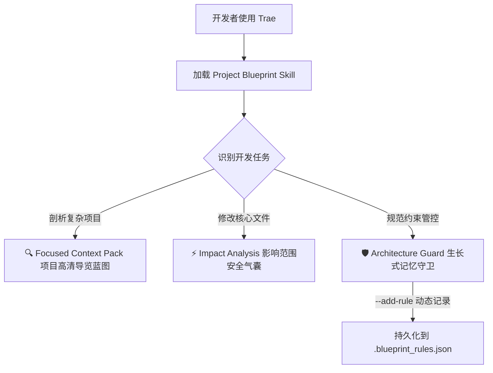

# 🏆 【Trae Skill 创作】大中型项目结对编程神器！拒绝上下文爆炸与重构爆红，我做了一个具备“生长式记忆”的【项目蓝图与架构守卫】 Skill

大家好！我是开发者 **zzhqqa478850-lang**。

今天想在 Trae 社区分享一个我最近花费大量心血打磨的通用项目级辅助 Skill：**Project Blueprint (项目蓝图与架构守卫)**。

不管你是刚入行的开发新手，还是带队重构的老兵，只要你在使用 Trae 的 **Agent 模式** 或 **Composer** 来协同编写中大型项目，这个 Skill 都能为你的 AI 辅助开发体验带来质的飞跃！

* 🔗 **开源仓库地址**：[https://github.com/zzhqqa478850-lang/project-blueprint-agent](https://github.com/zzhqqa478850-lang/project-blueprint-agent)
* 💡 **核心定位**：项目静态依赖雷达 + 具备“自我生长式记忆”的架构守卫（全语言/通用型）

---

## 📌 痛点剖析：结对编程时的三大“高血压瞬间”

在与 Trae Agent 结对编写复杂业务时，无论开发者的资历深浅，几乎都无法逃避以下三个严重阻碍生产力的“大坑”：

1. **上下文过载（Context Explosion）与 Agent “降智”**：
   项目规模稍微大一点，如果把大量不相干的代码堆给 Agent，不仅会迅速消耗宝贵的 Token，更会因为海量无关信息的噪声，导致 Agent 抓不住核心业务，甚至频繁产生幻觉。
2. **底层改动“牵一发而动全身”的重构噩梦**：
   重构或修改某个底层公共工具类或 Database Model 时，Agent 很难完全看清全局依赖关系。一顿盲目修改保存后，控制台瞬间爆出几十个上游依赖模块的编译报错，重构直接变成“排雷”。
3. **团队规范与架构约束的“慢性劣化”（Architecture Decay）**：
   每一个成熟的项目都有特定的编写规范（如：*“网络请求必须走统一封装拦截”*，或 *“在此微服务中禁止直接引用第三方依赖 A”*）。即便我们在对话中多次叮嘱，只要开启新 Session 或者上下文变长，Agent 立马转头就忘，导致代码架构逐渐失守。

为了攻克这些所有开发者都会遇到的通用痛点，我设计并实现了 **Project Blueprint**。它由一个**本地高性能 Python 静态分析引擎** + 一个**高度特化的 Trae 系统指令集（SKILL.md）**共同驱动，为 Trae Agent 装配了全方位的架构治理工具。

---

## ✨ 核心特性深度解析：为高效开发装配的三大“安全屏障”



### 1. 🔍 智能项目扫描与精准打包 (Focused Context Pack)
让 Agent 具备“用多少读多少”的极高情商：
* **一键项目蓝图**：在项目根目录一键扫描（自动跳过 `node_modules`、`venv`、`__pycache__` 等），自动解析技术栈、依赖库和入口文件，为每个文件夹自动生成包含功能职责说明的 `PROJECT_BLUEPRINT.md`，作为人机协同的第一张“高清地图”。
* **微型上下文打包 (Micro-index)**：当处理具体任务时，Agent 可以调用命令行只提取特定模块及其直接上下游依赖的轻量级 JSON，**在几万行的项目中精准过滤并提取最相关的 50 行**，将 Token 消耗降低 90% 以上，彻底杜绝 Agent 幻觉！

### 2. ⚡ 影响范围分析雷达 (Impact Analysis)
开发者的“重构安全气囊”，再也不怕底层改动引发编译雪崩。
* 在 Trae Agent 准备重构或修改任何底层文件前，Skill 会驱动它自动在后台执行 `python -m project_blueprint -i <file_path>`。
* 静态分析引擎通过 AST 解析，**瞬间揪出所有引用/导入了此文件的上游模块**。
* Agent 会在修改前主动向你汇报：“已为您启动影响范围雷达。修改该文件会影响上游的 3 个 Controller，我已为您制定了兼容性重构策略，并在修改后为您进行联动验证。”让每一次底层重构都稳如泰山！

### 3. 🛡️ 架构守卫与“自我生长式记忆” (Architecture Guard)
把冷冰冰的项目规范变成 Agent **会呼吸、会成长**的动态记忆体：
* **静态约束加载**：项目的规范和禁止事项保存在 `.blueprint_rules.json` 中，Agent 每次拉取蓝图时强制阅读，防止写出违规代码。
* **生长式记忆**：在开发过程中，一旦你和 Agent 达成共识（例如：*“我们以后所有的 API 响应都必须统一格式，且禁止直接返回 raw dict”*）。Trae 在理解后，**会主动在终端执行命令行：**
  ```bash
  python -m project_blueprint --add-rule "API响应必须使用标准Response格式，禁止返回 raw dict"
  ```
  **直接将新规矩永久写入本地配置文件中**！即使你清理了当前对话，这条规则也会在下一次对话中被重新加载，实现了**跨越 Session 限制的生长式记忆**！

### 💡 4. 智能探测与主动依赖补全 (Proactive Dependency Detection)
针对快速原型项目或缺少依赖文件的老代码：
* **主动出击**：如果扫描发现项目里缺少依赖配置文件，Skill 会驱动 Trae 主动分析所有代码的 `import` 关系，过滤掉标准库，整理出项目实际使用的第三方库列表。
* **温暖提议**：Trae 会主动问：“我发现您的项目是 Python 项目，但缺少 requirements.txt。我帮您识别出使用了 `chromadb` 和 `pdfplumber`，需要我现在帮您一键生成 `requirements.txt` 并补全项目蓝图吗？”极具人性化温度！

---

## 🛠️ 创作过程与技术演进：从“说明生成器”到“Agent-Native”的多次迭代

好的创意离不开严谨的技术方案论证。这个 Skill 并不是一蹴而就的，而是在与 AI 结对编程的过程中，经历了多次关键的技术设计自审、模块重构与演进才最终诞生出来的：

### 第一阶段：设计思路确立与“说明生成器”逻辑自审
我们首先对“项目蓝图”的核心——**说明生成器（Description Generator）**的逻辑进行了详尽的策略讨论。确立了它必须支持 Python、JS/TS、Java、Go、Rust 等多语言的智能推导，通过读取配置文件（`package.json`、`pyproject.toml` 等）、入口文件识别、命名匹配以及文件内容摘要（读取前几行获取注释和定义）来智能归纳子目录职责。

为了保证工程质量，我们严密制定了开发设计方案自审清单（Checklist），从核心模块、技术实现、交互方式、创新点到开发计划进行了逐一核对，并生成了项目设计文档 `2026-05-22-project-blueprint-design.md`。

> 💡 **（请在此处插入您的第 1 张截图：讨论第四部分说明生成器和核心逻辑的对话）**
> 
> 💡 **（请在此处插入您的第 2 张截图：包含设计自审完成和生成 project-blueprint-design.md 的对话）**

---

### 第二阶段：Agent-Native 2.0 深度架构重构
在初步实现了文件生成后，我们做了一个大胆的决定：**要让这个工具完全为 Agent 所用（Agent-Native）**。如果只生成 Markdown 文本，Agent 难以在后台调用并进行高精度的计算。因此，我们对整个静态分析引擎进行了一次革命性的 Agent-Native 2.0 重构：

1. **新增 `ast_parser.py`**：利用 Python 标准库中的 AST（抽象语法树）解析器，真正“阅读”和拆解 Python 代码，提取出 Class 定义、Function 定义以及 Import 关系。
2. **升级 `analyzer.py`**：基于 AST 数据自动构建项目内部的微缩索引（Micro-index）与反向依赖图（Reverse Import Graph），并且能自动推断出项目分层架构规则（如“Models 层独立于 Controllers 层”）。
3. **改造 `main.py` 和 `SKILL.md`**：在执行 `python run_blueprint.py -j` 时，直接在终端中吐出超高密度的结构化 JSON。Trae Agent 接收到这组结构化 JSON 后，能实现极其精准的全局依赖感知，彻底告别了“盲目猜测”和全库搜索！

重构的顺利完成，标志着 `Project Blueprint` 正式从一个“文档生成器”升华为了一个高情商、高密度的“Agent-Native 架构守卫”。

> 💡 **（请在此处插入您的第 3 张截图：关于 Agent-Native 2.0 重构完毕大功告成的对话）**

---

## 🚀 玩家如何把 Skill 装进您的 Trae？

得益于 Trae 极其强大的**终端工具自动执行能力**，仅需两步即可装配：

### 第一步：在您的本地环境中安装分析引擎
在您当前开发的项目根目录下：
```bash
git clone https://github.com/zzhqqa478850-lang/project-blueprint-agent.git
cd project-blueprint-agent
pip install -e .
```

### 第二步：让 Trae 感知 Skill
1. 在您的项目根目录下，创建一个规则文件，命名为 `.traerules`。
2. 将本仓库根目录下 [SKILL.md](https://github.com/zzhqqa478850-lang/project-blueprint-agent/blob/main/SKILL.md) 里的全部 Prompt 复制粘贴进去。
3. **开始丝滑开发！**

---

## 💡 真实运行效果与产物展示 (Real-world Running Effects & Products Showcase)

为了验证本 Skill 的实际效果，我们在本地导入了一款没有任何依赖声明文件的 RAG 检索增强生成项目 `PythonProject4` 进行深度实测。

### 1. 一键触发分析：3 分钟摸清万行代码！
在输入框输入触发词：
> **开发者**：`[project-blueprint] 帮我全面分析一下这个项目，生成一份项目蓝图文档。`

**Trae Agent 耗时 3m 40s 完成了深度静态与动态剖析，并主动输出了高可读的项目概览：**
系统智能识别出这是一款**“面向 Ansys Maxwell 电磁仿真软件的智能文档知识助手系统”**，并自动提取并提炼出了其 5 大核心技术能力：
* **PDF 智能解析**：将技术 PDF 解析为结构化 Markdown，支持数学公式识别与表格提取。
* **向量知识库**：基于 ChromaDB 的增量式向量库，支持语义检索。
* **RAG 检索增强生成**：带意图识别、查询改写、重排序的完整检索链路。
* **ReAct Agent 推理**：支持 5 大文档工具的智能推理框架。
* **短期记忆对话**：多轮对话上下文补全与记忆管理。

> 💡 **（请在此处插入您的第 4 张截图：全项目扫描启动与项目概览表格的对话界面）**

---

### 2. 影响范围雷达：秒级评估重构波及的间接依赖与数据流风险！
当我们需要重构或修改底层的 `custom_pdf_parser.py` 时，输入提问：
> **开发者**：`我想修改 custom_pdf_parser.py，请帮我分析一下修改它的影响范围，看看会波及哪些文件。`

**Trae Agent 耗时仅 1m 32s 便自动输出了一份极其硬核、细致到数据流层面的“完整影响范围报告”：**
* **精准依赖剖析**：
  - 静态分析器准确识别出 `custom_pdf_parser.py` 是一个相对独立的“叶子模块”，并无其他 Python 文件在代码层面**直接 `import` 导入**它。
  - **但真正震撼的是**，它并没有草率地得出“无风险”结论，而是极其敏锐地捕获并指出了其存在**“间接的数据流层面影响”**！
* **分级安全区域与修改建议**：
  - 🟢 **安全修改 (低风险)**：优化 `LatexFormulaConverter` 识别率、调整字体大小阈值 (`font_size_thresholds`)、修改日志格式等可直接放心修改。
  - 🟡 **需谨慎的修改 (中风险)**：修改 `TextBlock` / `TableData` 字段或修改 `parse_pdf()` 的返回 Dict 结构（警告如果把键名 `"pages"` 改成 `"page_contents"`），**下游直接消费者 `parse_single_pdf_custom()` 就会爆红出错**！
  - 🔴 **高风险修改**：重命名函数会破坏调用链；更强的是，**它警告改变 Markdown 的章节结构会直接影响向量库 ChromaDB 的 `header` 元数据，进而拉低 RAG 检索召回质量**（这架构大局观简直无懈可击！）。

> 💡 **（请在此处插入您的第 7 张截图：直接依赖与低/中/高三色风险等级修改建议界面）**
> 
> 💡 **（请在此处插入您的第 8 张截图：解析 parse_pdf 返回 Dict 结构与下游间接影响分析界面）**

---

### 3. 震撼的“代码体检”：智能列出项目缺陷与优化建议
在分析完架构后，本 Skill 驱动 Trae Agent 对项目进行了一次全面体检，自动输出了一份**“发现的问题与建议”表格**，直接揪出项目内部隐藏的工程雷区：

* **`1.py` 为废弃草稿** (位置：根目录) ➡️ 建议可删除或归档。
* **`rag_pipeline.py` 有乱码** (位置：`第 677 行`) ➡️ 建议清理意外输入的乱码字符（**精准扫描到代码具体行号！**）。
* **`Embedding` 服务硬编码 IP** (位置：多处) ➡️ 建议改为从环境变量或配置文件读取（**规避硬编码安全风险！**）。
* **无单元测试** (位置：整个项目) ➡️ 建议为核心模块添加测试。

这种高精度的静态审计能力，能瞬间帮助开发人员理清项目遗留的技术债，避免盲目修改引发的线上事故！

---

### 4. 架构守卫与“生长式记忆”：规矩说一遍，AI 主动记本子并自动扩增！
当我们希望在项目中制定一些强约束，且不希望开启新 Session 被 Agent 遗忘时，我们尝试向 Agent 提问（甚至可以极其严苛地一次性抛出两条复杂的规则）：
> **开发者**：`“在这个项目里，所有 RAG 管道组件在修改前都必须验证 Chroma 兼容性。帮我把这条架构规则永久记住。”或：“我们项目里禁止使用 PyPDF2 了，统一用 pdfplumber，帮我记录到守卫规则里。”`

**Trae Agent 的表现极其惊艳，展现出了让人叹服的“架构师自我修养”：**
* **结构化自动规整**：它并没有简单地把这一行话存下来，而是自动剖析了规则的深意，分析了它们的作用域（Scope），并将其归纳、转换为高可读的 **Rule 8** 与 **Rule 9**！
  - **Rule 8 (Chroma 兼容性验证)**：作用域智能自动绑定到了 `retrieval_pipeline.py`、`rag_pipeline.py`、`agent_tools.py` 和 `build_vector_db.py` 等与向量库强关联的所有模块。
  - **Rule 9 (PDF 解析库统一)**：作用域智能绑定到了 `custom_pdf_parser.py` 及任何未来相关的 PDF 解析模块。
* **文件级物理持久化**：它在后台执行命令行，将这两条规则永久写入了本地的 `.blueprint_rules.json` 中。
* **与蓝图规则自动并列**：最炫的是，这两条规则会自动与原有 7 条静态推演出的项目底层规则并排，作为 **Rule 8 (Chroma 兼容性验证) 新增** 写入 `PROJECT_BLUEPRINT.md`，真正实现了“项目规矩跟着代码一起生长”！

> 💡 **（请在此处插入您的第 9 张截图：录入规则后自动规整的已保存守卫规则表格展示）**
> 
> 💡 **（请在此处插入您的第 10 张截图：展示规则生效位置，与原有7条规则自动并列新增为第8条规则的界面）**

---

### 5. 主动治愈：一键补全缺失的依赖声明
由于该项目是“裸项目”（没有 `requirements.txt`），本 Skill 触发了**主动依赖探测机制**：
* 静态分析引擎自动提取所有 `.py` 文件的 `import` 关系，锁定第三方包（如 `chromadb`）。
* 在产物汇总中，Trae 主动为项目一键创建并输出了两个核心文件：
  1. **`PROJECT_BLUEPRINT.md`**（结构化项目地图）
  2. **`requirements.txt`**（自动提取并生成的第三方依赖包清单！）

> 💡 **（请在此处插入您的第 5 张截图：包含问题建议表格以及生成 requirements.txt 的对话产物汇总界面）**

---

### 6. 终极产物：极度精美的高清项目蓝图文档
以下是本 Skill 最终自动生成的 `PROJECT_BLUEPRINT.md` 文档全貌。包含自动跳过无关文件后生成的完整目录树结构、配置依赖列表、各文件夹的职责划分与运行步骤说明：

> 💡 **（请在此处插入您的第 6 张截图：极度精美的高清项目蓝图文档PROJECT_BLUEPRINT.md长图展示）**

---

## 📝 开发者感悟与结语

我做这个 Skill 的初衷，就是希望**用好工具和透明的信息，去解决 AI 结对编程中的不确定性**。

AI 编程时代的最佳实践，绝不仅仅是让 AI 帮我们“疯狂打字”，而是让我们和 AI 共同拥有一张清晰的、具备**“生长式记忆”的项目蓝图与规则守卫**。让每一次重构都安全可靠，让每一次代码提交都稳如泰山。

非常期待能在 Trae 社区和大家多多交流！如果这个 Skill 能够对你的项目开发有所帮助，**欢迎前往我的 [GitHub 仓库](https://github.com/zzhqqa478850-lang/project-blueprint-agent) 点个 Star⭐！** 也非常欢迎大家留下建议或提交 PR，让我们共同把 Trae 结对编程推向更高的生产力维度！

---
*📅 投稿赛道：SOLO技能创作赛*  
*💻 创作者：zzhqqa478850-lang*  
